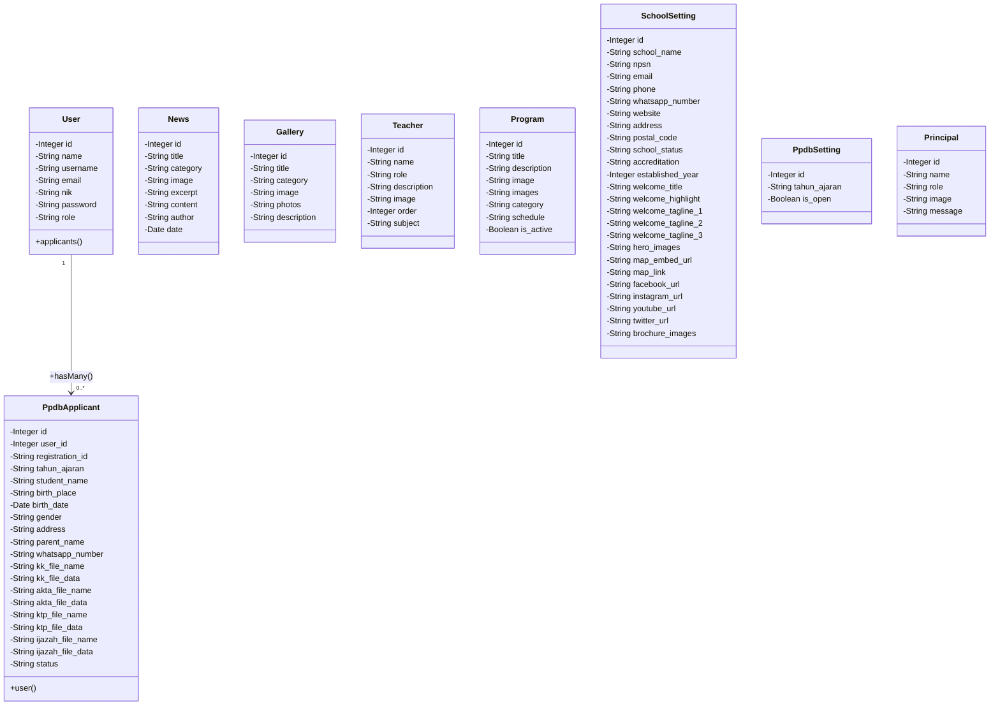

```mermaid
classDiagram
    %% ==========================================
    %% CLASS DIAGRAM IMPLEMENTASI (Sesuai Kode Laravel)
    %% ==========================================

    class User {
        -Integer id
        -String name
        -String username
        -String email
        -String nik
        -String password
        -String role
        +applicants()
    }

    class PpdbApplicant {
        -Integer id
        -Integer user_id
        -String registration_id
        -String tahun_ajaran
        -String student_name
        -String birth_place
        -Date birth_date
        -String gender
        -String address
        -String parent_name
        -String whatsapp_number
        -String kk_file_name
        -String kk_file_data
        -String akta_file_name
        -String akta_file_data
        -String ktp_file_name
        -String ktp_file_data
        -String ijazah_file_name
        -String ijazah_file_data
        -String status
        +user()
    }

    class News {
        -Integer id
        -String title
        -String category
        -String image
        -String excerpt
        -String content
        -String author
        -Date date
    }

    class Gallery {
        -Integer id
        -String title
        -String category
        -String image
        -String photos
        -String description
    }

    class Teacher {
        -Integer id
        -String name
        -String role
        -String description
        -String image
        -Integer order
        -String subject
    }

    class Program {
        -Integer id
        -String title
        -String description
        -String image
        -String images
        -String category
        -String schedule
        -Boolean is_active
    }

    class SchoolSetting {
        -Integer id
        -String school_name
        -String npsn
        -String email
        -String phone
        -String whatsapp_number
        -String website
        -String address
        -String postal_code
        -String school_status
        -String accreditation
        -Integer established_year
        -String welcome_title
        -String welcome_highlight
        -String welcome_tagline_1
        -String welcome_tagline_2
        -String welcome_tagline_3
        -String hero_images
        -String map_embed_url
        -String map_link
        -String facebook_url
        -String instagram_url
        -String youtube_url
        -String twitter_url
        -String brochure_images
    }

    class PpdbSetting {
        -Integer id
        -String tahun_ajaran
        -Boolean is_open
    }

    class Principal {
        -Integer id
        -String name
        -String role
        -String image
        -String message
    }

    %% Hanya ada 1 relasi fisik (Foreign Key) di sistem kode Anda
    User "1" --> "0..*" PpdbApplicant : +hasMany()
```
